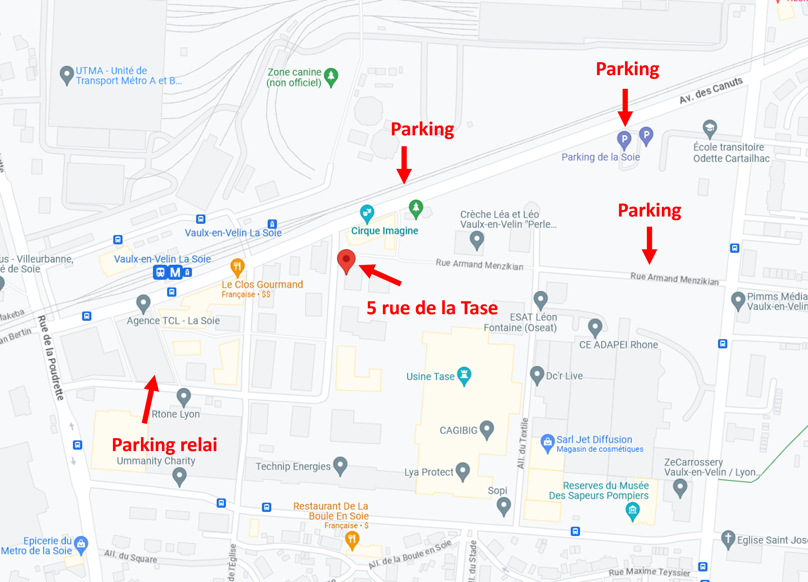
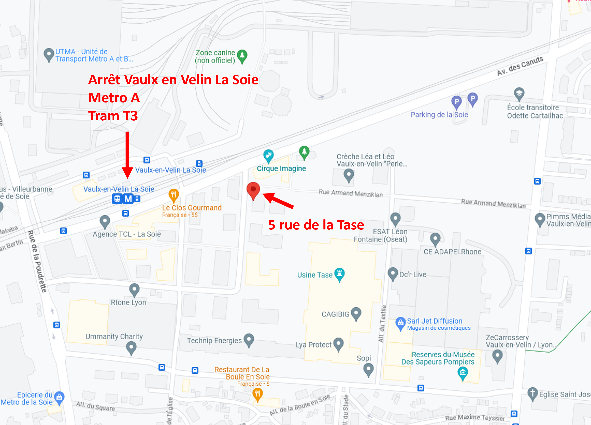
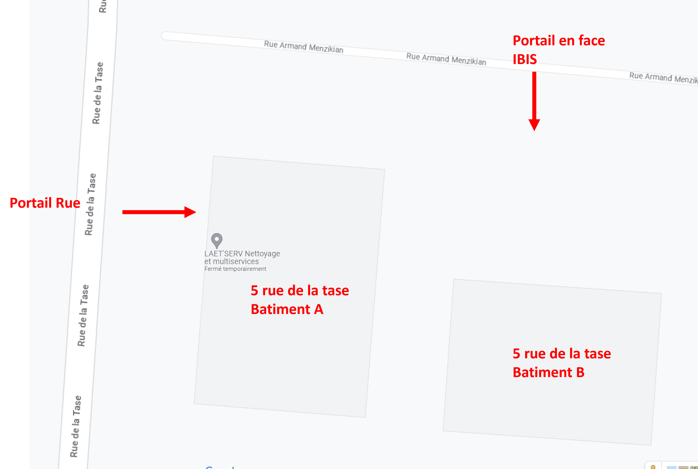

===================================
Come to Nono and Cao's House
===================================

The different ways
==================

By car
------

- Write in your GPS: 5 rue de la Tase, 69120 Vaulx en Velin or click here `🌍 GPS Nono & Cao <https://www.google.fr/maps/place/5+Rue+de+la+Tase,+69120+Vaulx-en-Velin/@45.7610094,4.9217403,17z/data=!3m1!4b1!4m6!3m5!1s0x47f4c0fd43f21143:0xd0c55b3b60b6cd4f!8m2!3d45.7610057!4d4.9243152!16s%2Fg%2F11cskkwj_z?entry=ttu>`_
- In general, it can be very complicated to find a place for your car, our different suggestions: 

  - rue Armand Menzikian / Allée du Textile
  - Avenue des Canuts
  - Parking de la Soie
  - Parking Relai Vaux en Velin La Soie

   

By Transport
------------
From Lyon, you can come to our home by using the public Transport 

- Metro A: Direction Vaulx en Velin La Soie. Stop at the Arrêt (Terminus): Vaulx en Velin La Soie 
- Tram T3: Direction Meyzieu les Panettes. Stop at the Arrêt (Terminus): Vaulx en Velin La Soie 

   

Entering the Batiment 5 rue la Tase
-----------------------------------

Our home is situated at the Building B, Level 1, left door.

When you arrive, there are 2 possibilities to enter the building:

- Gate directly on the street 
- Gate in front of the IBIS Hostel

We strongly advise that you come at the Gate in front of the IBIS Hotel (it will be easier after)

.. image:: come_to_nono_and_cao_house/gate_2.png
   
Then you can ring the bell by selecting on the interphone **DO DO-FAVIER**

If you enter from Building A 
-----------------------------

Go straight to the building (4 doors) to enter in the small garden. Do not go to the elevator !! This is 
not the right building

Otherwise
---------

You arrive in from of the gate of Building B, the code is **35916**

Inside Building B
-----------------

- Go to the right to take the elevator
- Write first the code to activate the elevator : **2604**
- Select then the level: Level 
- Our appartment is at level 1, it will be the door directly on the left
