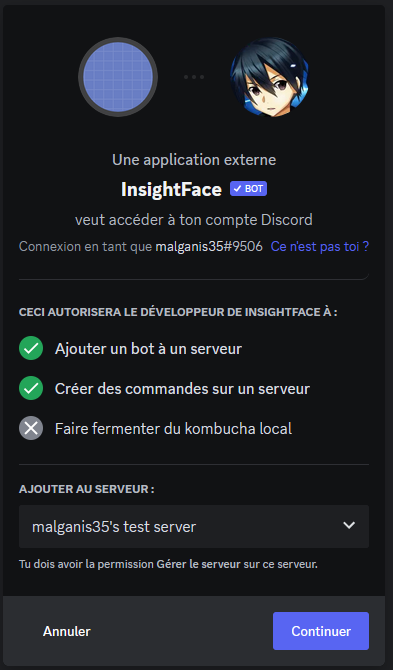
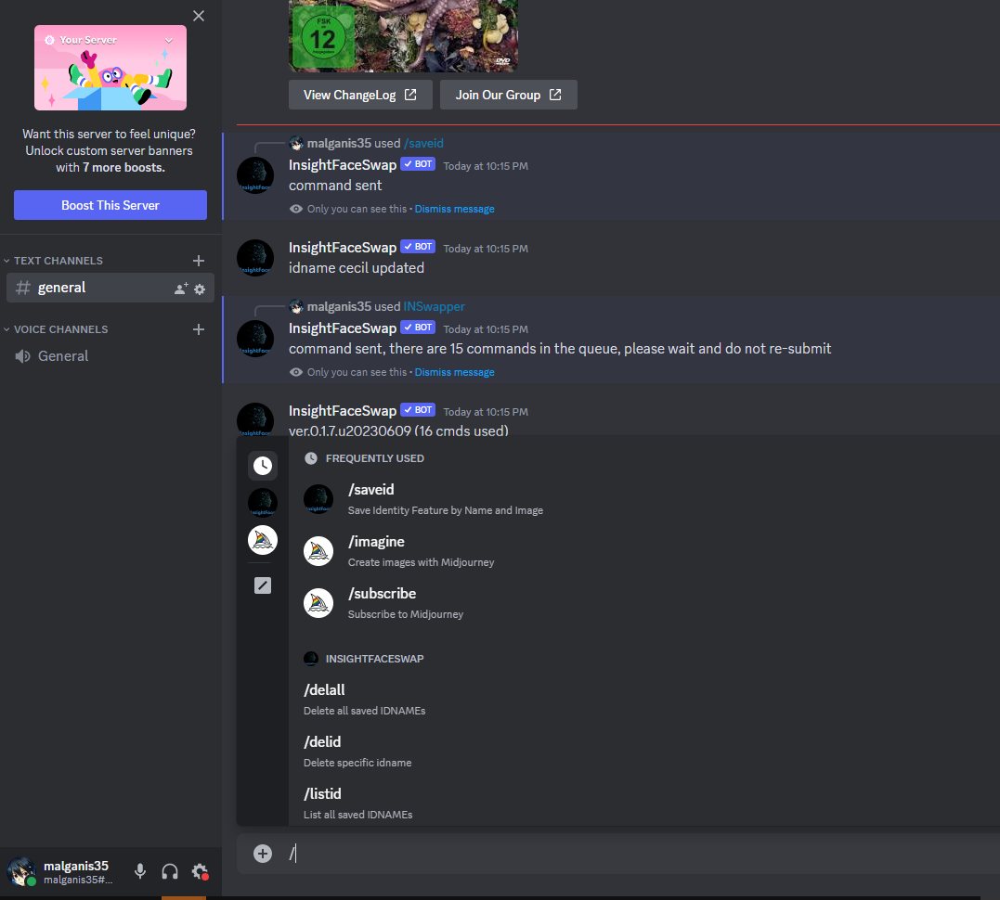
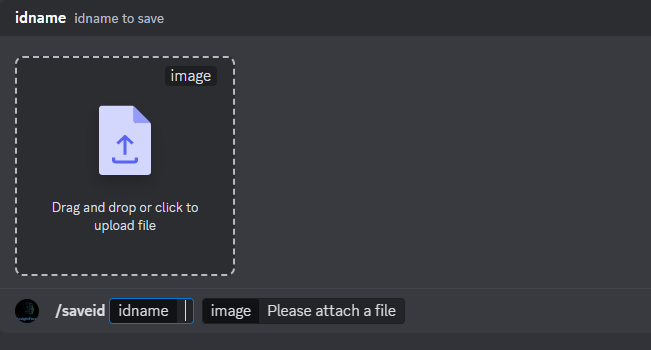
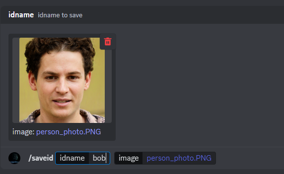
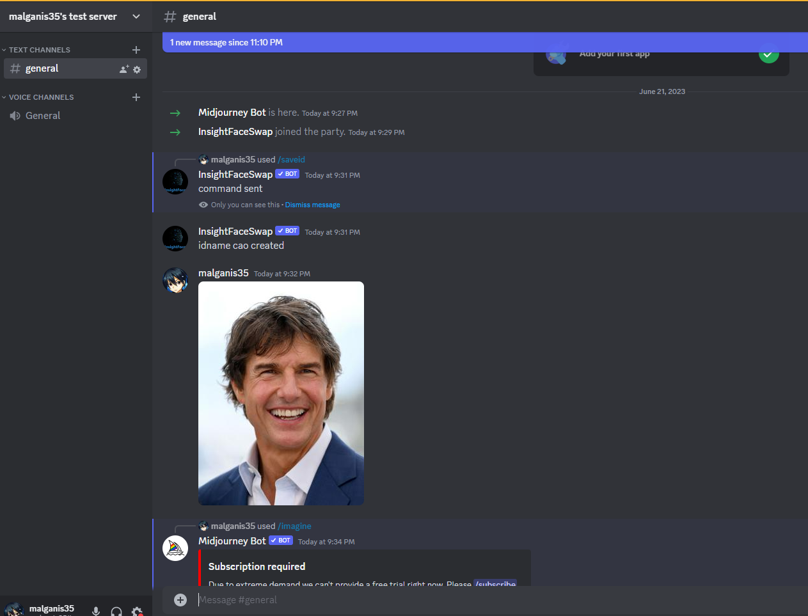
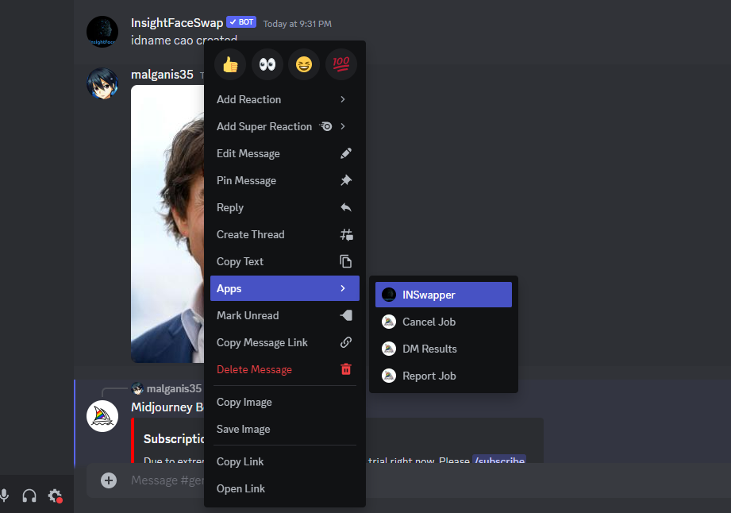

========================
Generative Image
========================

Replace human faces with FaceSwap IA
====================================

source: https://www.youtube.com/watch?v=KQXTlFq3hmc

Installation
------------

1. Create an account on Discord
2. Create a Discord Server

.. tab:: Step 1

    Select **Create my own**

    .. image:: image_generation/discord_server_creation1.PNG
        :width: 300px
        :align: center

.. tab:: Step 2

    Select **For me and my friends**

    .. image:: image_generation/discord_server_creation2.PNG
        :width: 300px
        :align: center
   
.. tab:: Step 3

    Give it a name and clik on **OK**

    .. image:: image_generation/discord_server_creation3.PNG
        :width: 300px
        :align: center   

3. Add FaceSwap IA bot by clicking to this `Invitation Link <https://discord.com/oauth2/authorize?client_id=1090660574196674713&permissions=274877945856&scope=bot>`_ 

4. Select the Discord server you have previously created

Usage
-----

The objective will be to:

.. tab:: Real face

    Take the face of this person
    
    .. image:: image_generation/person_photo.PNG
        :width: 200px
        :align: center  

.. tab:: Replace here

    Replace the face of this image 

    .. image:: image_generation/tom_cruise.PNG
        :width: 200px
        :align: center  

.. tab:: Result
    
    To obtain this:
    
    .. image:: image_generation/person_photo_transformed.PNG
        :width: 200px
        :align: center 

1. Tap the command ``/saveid`` in your discord chat

2. Drag and drop an image that is the face you want to implement in another image 

For example, I will you this person face

and I will obtain:

3. Drag and drop an image in the Discord Tchat you would like to modify. For example this image 

4. Right click on the image you would like to replace and select App --> INSwapper

5. After a few seconds, you will see the results :

