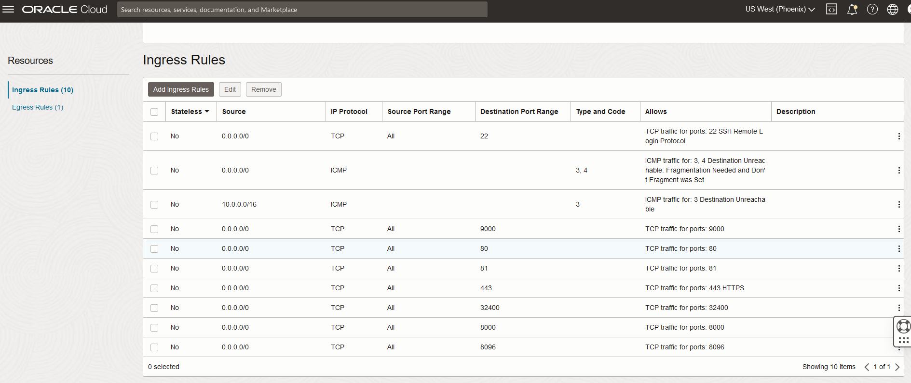

============================
Jellyfin Installation
============================
:Authors:
    Cao Tri DO <cao-tri.do@mazars.fr>
:Version: 2023 08

Installation
============

Fom the official documentation: https://jellyfin.org/docs/general/installation/linux#ubuntu

Install first the ``apt-transport-https``. This APT transport allows the use of repositories accessed via the HTTP Secure protocol (HTTPS), also referred to as HTTP over TLS. 
It is available by default since apt 1.5 and was available before that in the package apt-transport-https.

.. code-block:: bash
  
  sudo apt install apt-transport-https

Then, Jellyfin provide an installer script to easily configure the Jellyfin APT repository. All you need to do is run this command on your system:

.. code:: bash

   wget -O- https://repo.jellyfin.org/install-debuntu.sh | sudo bash

You can check that the service is starting by using the command:

.. code-block:: bash

  sudo service jellyfin status  

If the service is not running, you can start it by using the command:

.. code-block:: bash

  sudo service jellyfin start  

Complementary configuration on Oracle Cloud
===========================================

You will need to open the port of the machine on the virtual network on your Oracle account according to this image

Finally open the port on the machine coming from this website: https://www.reddit.com/r/jellyfin/comments/sr792b/using_oracles_cloud_arm_vm_free_tier_as_a/

You will to disable instance firewall on Ubuntu on Oracle Cloud in order to be able to access it from the internet in your console command (https://techoverflow.net/2021/08/19/how-to-disable-instance-firewall-on-ubuntu-on-oracle-cloud/):

.. code-block:: bash

  sudo iptables -F
  sudo netfilter-persistent save

Access to the jellyfin server
=============================

Access to the IP Address of the machine through the port 4096. For example: srv002.astraviz.fr:4096
You will have to follow the tutorial. If needed, you can use this video: https://www.youtube.com/watch?v=eJvQKLVrmU8

Organisation of the shows
=========================

Look at this website: https://jellyfin.org/docs/general/server/media/shows/